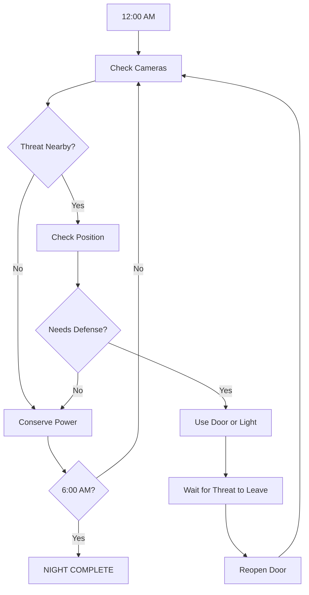

<div align="center">

# FIVE NIGHTS AT NEEGY'S

### `MONEY NEVER SLEEPS.`

**A browser-based FNAF-inspired horror parody.**

Survive five nights. Watch the cameras. Manage your power.
And whatever you do... **don't get caught lacking.**


</div>

---

# 🎮 ENTER NEEGY'S

> **12:00 AM**
> The doors are locked.
> The cameras are live.
> The power meter is dropping.
> Something is moving in the building.

You have one job:

# MAKE IT TO 6:00 AM.

Five main nights stand between you and the end of your shift.

Each night gets harder.

Beat all five and you unlock **Night 6**.

Beat Night 6 and you unlock the final challenge:

# NIGHT 7: 20/20 MODE

---

# 🌙 THE NIGHTS

<details>
<summary><strong>▶ NIGHT 1</strong></summary>

<br>

## FIRST SHIFT

```text
DIFFICULTY

█░░░░
```

Welcome to Neegy's.

Night 1 introduces the core systems.

Learn the cameras.

Learn the office.

Watch your power.

Figure out how enemies move.

Enemy activity is relatively low, giving you time to learn the game before things start getting serious.

### OBJECTIVE

Survive from:

```text
12:00 AM
   ↓
6:00 AM
```

</details>

---

<details>
<summary><strong>▶ NIGHT 2</strong></summary>

<br>

## THINGS START MOVING

```text
DIFFICULTY

██░░░
```

The building becomes more active.

Enemies begin moving more often.

Camera checks become more important.

You still have time to react, but wasting power starts becoming dangerous.

### EXPECT

* more movement
* more camera activity
* higher power usage
* shorter reaction windows

</details>

---

<details>
<summary><strong>▶ NIGHT 3</strong></summary>

<br>

## THEY KNOW YOU'RE HERE

```text
DIFFICULTY

███░░
```

Things start getting serious.

Movement becomes faster.

Threats become less predictable.

You have less time to react when something gets close.

Power management becomes one of the most important parts of surviving the night.

### EXPECT

* faster enemies
* more frequent camera checks
* less room for mistakes
* increased pressure

</details>

---

<details>
<summary><strong>▶ NIGHT 4</strong></summary>

<br>

## DON'T GET COMFORTABLE

```text
DIFFICULTY

████░
```

Night 4 turns everything up.

Enemies become significantly more aggressive.

Camera checks need to be quick.

Doors need to be used carefully.

Lights need to be used carefully.

Every wasted second matters.

Every wasted percentage of power matters.

### EXPECT

* aggressive enemy movement
* faster reactions
* tight power management
* very small safe windows

</details>

---

<details>
<summary><strong>▶ NIGHT 5</strong></summary>

<br>

# FINAL SHIFT

```text
DIFFICULTY

█████
```

The final night of the main game.

Everything you learned during Nights 1 through 4 matters here.

Enemies are faster.

Power is more important.

Mistakes are harder to recover from.

There are no training wheels.

### SURVIVE NIGHT 5 TO COMPLETE THE MAIN GAME.

```text
12:00 AM

↓

1:00 AM

↓

2:00 AM

↓

3:00 AM

↓

4:00 AM

↓

5:00 AM

↓

6:00 AM

MAIN GAME COMPLETE
```

Completing Night 5 unlocks:

# NIGHT 6

</details>

---

<details>
<summary><strong>🔒 NIGHT 6</strong></summary>

<br>

# OVERTIME

```text
DIFFICULTY

██████
```

Night 6 is unlocked after completing Night 5.

This is not part of the normal five-night story.

This is the extra challenge.

Enemies become even more aggressive than they were during Night 5.

Power management becomes tighter.

Reaction windows become shorter.

Mistakes become extremely difficult to recover from.

### NIGHT 6 EXPECTS YOU TO ALREADY KNOW THE GAME.

No tutorials.

No easy start.

No mercy.

Beat Night 6 to unlock the final night.

# NIGHT 7

</details>

---

<details>
<summary><strong>🔒 NIGHT 7</strong></summary>

<br>

# 20 / 20 MODE

```text
████████████████████

       20 / 20
```

Night 7 is unlocked after completing Night 6.

This is the hardest challenge in **Five Nights at Neegy's**.

Every enemy is set to its maximum aggression level.

```text
ENEMY 01 ........ 20

ENEMY 02 ........ 20

ENEMY 03 ........ 20

ENEMY 04 ........ 20
```

No warm-up.

No slow beginning.

No safe strategy.

No easy cameras.

No wasted power.

No wasted time.

```text
POWER ........... LIMITED

CAMERAS ......... ACTIVE

THREATS ......... MAXIMUM

TIME ............ 12 AM - 6 AM

DIFFICULTY ...... 20 / 20
```

### SURVIVE 20/20 MODE.

</details>

---

# 🏆 PROGRESSION

```text
NIGHT 1
   │
   ▼
NIGHT 2
   │
   ▼
NIGHT 3
   │
   ▼
NIGHT 4
   │
   ▼
NIGHT 5
   │
   ▼
MAIN GAME COMPLETE
   │
   ▼
NIGHT 6
   │
   ▼
NIGHT 7
   │
   ▼
20 / 20 MODE
```

---

# 📹 SECURITY SYSTEM

Your office contains everything you need to survive.

It also contains everything draining your power.

| System     | Purpose                       | Risk                                                 |
| ---------- | ----------------------------- | ---------------------------------------------------- |
| 📷 Cameras | Track movement around Neegy's | Staying on cameras too long can leave you vulnerable |
| 🚪 Doors   | Block nearby threats          | Uses power                                           |
| 💡 Lights  | Check nearby areas            | Uses power                                           |
| 🔋 Power   | Keeps the office running      | Reach 0% and your systems shut down                  |
| 🕛 Clock   | Tracks the current hour       | Reach 6:00 AM to survive                             |

---

# 🔋 POWER SYSTEM

Power is limited.

Nearly everything you do affects it.

```text
POWER

██████████ 100%

█████████░ 90%

████████░░ 80%

███████░░░ 70%

██████░░░░ 60%

█████░░░░░ 50%

████░░░░░░ 40%

███░░░░░░░ 30%

██░░░░░░░░ 20%

█░░░░░░░░░ 10%

░░░░░░░░░░ 0%
```

At `0%`, important office systems stop working.

So yeah.

Maybe don't leave both doors closed for three hours 💀

---

# 🕛 TIME SYSTEM

Every night begins at:

```text
12:00 AM
```

And ends at:

```text
6:00 AM
```

Your goal is simple.

Survive every hour.

```text
12 AM
 │
 ▼
1 AM
 │
 ▼
2 AM
 │
 ▼
3 AM
 │
 ▼
4 AM
 │
 ▼
5 AM
 │
 ▼
6 AM
```

---

# 🗺️ CORE GAME LOOP



---

# 👁️ CAMERA SYSTEM

The player can switch between security cameras located around Neegy's.

The camera system is your main way of tracking enemy movement.

Example camera layout:

```text
                    ┌─────────────┐
                    │   CAM 01    │
                    │  MAIN ROOM  │
                    └──────┬──────┘
                           │
                ┌──────────┴──────────┐
                │                     │
          ┌─────▼─────┐         ┌─────▼─────┐
          │  CAM 02   │         │  CAM 03   │
          │ LEFT HALL │         │RIGHT HALL │
          └─────┬─────┘         └─────┬─────┘
                │                     │
                │                     │
          ┌─────▼─────┐         ┌─────▼─────┐
          │  CAM 04   │         │  CAM 05   │
          │ LEFT SIDE │         │RIGHT SIDE │
          └─────┬─────┘         └─────┬─────┘
                │                     │
                └──────────┬──────────┘
                           │
                    ┌──────▼──────┐
                    │   OFFICE    │
                    │     YOU     │
                    └─────────────┘
```

Camera layouts may change as development continues.

---

# 🚪 DOORS

Doors protect the office.

Closing one can stop a nearby threat from entering.

But closed doors use power.

```text
LEFT DOOR

[ OPEN ]
```

```text
RIGHT DOOR

[ OPEN ]
```

Use them too much and you will drain your power.

Use them too little and...

yeah 💀

---

# 💡 LIGHTS

Lights allow you to check areas directly outside the office.

```text
LEFT LIGHT

[ OFF ]
```

```text
RIGHT LIGHT

[ OFF ]
```

They provide quick information without opening the full camera system.

But like the doors, they consume power.

---

# 💸 THE NEEGY'S VIBE

The entire game follows a dark money-themed visual style.

### MAIN COLORS

```text
BLACK

NEON GREEN

GOLD
```

### VISUAL ELEMENTS

* dark backgrounds
* neon green lighting
* gold accents
* money-themed visuals
* CRT effects
* VHS effects
* camera static
* glitch effects
* grain
* flickering lights
* distorted screens
* dark rooms
* security monitors
* old equipment
* ominous ambience

The game should feel like an old security system running inside a building you definitely should not be in.

---

# 🔊 AUDIO

Audio will play a major role in knowing what is happening around the building.

Planned audio includes:

* footsteps
* distant movement
* camera static
* door sounds
* light switches
* electrical noises
* ambience
* background hum
* enemy sounds
* warning sounds
* clock transitions
* jumpscare audio

Sometimes hearing something will be more useful than seeing it.

---

# 🧠 ENEMY AI

Enemies will use aggression levels to determine how often they attempt to move.

Lower nights will use lower aggression values.

Later nights will increase them.

Example:

```text
NIGHT 1

ENEMY 01 ........ 2
ENEMY 02 ........ 0
ENEMY 03 ........ 1
ENEMY 04 ........ 0
```

Later:

```text
NIGHT 5

ENEMY 01 ........ 12
ENEMY 02 ........ 15
ENEMY 03 ........ 13
ENEMY 04 ........ 16
```

Night 7:

```text
20 / 20 MODE

ENEMY 01 ........ 20
ENEMY 02 ........ 20
ENEMY 03 ........ 20
ENEMY 04 ........ 20
```

---

# 🎮 CONTROLS

Final controls may change during development.

Planned actions include:

```text
MOUSE / TOUCH

CAMERA BUTTON
OPEN CAMERAS

CAMERA MAP
CHANGE CAMERA

LEFT DOOR
TOGGLE LEFT DOOR

RIGHT DOOR
TOGGLE RIGHT DOOR

LEFT LIGHT
TOGGLE LEFT LIGHT

RIGHT LIGHT
TOGGLE RIGHT LIGHT
```

The game is planned to work directly inside a browser.

---

# 🛠️ DEVELOPMENT STATUS

## CORE

* [x] Repository created
* [x] Game concept created
* [x] Name chosen
* [x] README created
* [x] Night progression planned
* [ ] Main menu
* [ ] Continue system
* [ ] Save system
* [ ] Settings menu
* [ ] Extras menu

## GAMEPLAY

* [ ] Office
* [ ] Camera system
* [ ] Camera switching
* [ ] Power system
* [ ] Door system
* [ ] Light system
* [ ] Clock system
* [ ] Usage meter
* [ ] Enemy AI
* [ ] Enemy movement
* [ ] Difficulty progression

## NIGHTS

* [ ] Night 1
* [ ] Night 2
* [ ] Night 3
* [ ] Night 4
* [ ] Night 5
* [ ] Night 6
* [ ] Night 7
* [ ] 20/20 Mode

## AUDIO + VISUALS

* [ ] Ambience
* [ ] Sound effects
* [ ] Camera static
* [ ] CRT effects
* [ ] Glitch effects
* [ ] Animations
* [ ] Jumpscares
* [ ] Game over screen
* [ ] Night complete screen
* [ ] 6:00 AM sequence

## RELEASE

* [ ] Mobile support
* [ ] Desktop support
* [ ] Browser testing
* [ ] Performance optimization
* [ ] Final build
* [ ] Release

---

# 📁 PLANNED FILE STRUCTURE

```text
five-nights-at-neegys/
│
├── index.html
│
├── README.md
│
├── LICENSE
│
├── css/
│   ├── style.css
│   ├── office.css
│   ├── cameras.css
│   └── effects.css
│
├── js/
│   ├── game.js
│   ├── cameras.js
│   ├── power.js
│   ├── enemies.js
│   ├── nights.js
│   ├── audio.js
│   ├── save.js
│   └── menu.js
│
├── assets/
│   │
│   ├── audio/
│   │   ├── ambience/
│   │   ├── enemies/
│   │   ├── effects/
│   │   └── jumpscares/
│   │
│   ├── images/
│   │   ├── cameras/
│   │   ├── enemies/
│   │   ├── office/
│   │   ├── menu/
│   │   └── ui/
│   │
│   ├── video/
│   │
│   └── fonts/
│
└── data/
    ├── nights.json
    ├── enemies.json
    └── cameras.json
```

---

# 🚫 NO FORKING

## DO NOT FORK THIS REPOSITORY.

This project is not open for unofficial forks or copies.

Please do not:

* fork the repository
* mirror the repository
* reupload the project
* redistribute the project
* publish modified copies
* claim the project as your own
* create unofficial builds without permission

If you want to contribute, contact the project owner first.

```text
STAR THE REPO?        YES

WATCH THE REPO?       YES

CHECK OUT THE CODE?   YES

PLAY THE GAME?        YES

FORK IT?              NO.
```

---

# ⚠️ DISCLAIMER

**Five Nights at Neegy's** is an original fan-made parody project inspired by the survival-horror camera-management genre.

It is not an official **Five Nights at Freddy's** game.

This project is not affiliated with, sponsored by, or endorsed by Scott Cawthon or the official Five Nights at Freddy's franchise.

All original game-specific characters, locations, systems, artwork, audio, and other original assets created for Five Nights at Neegy's belong to their respective creator or creators.

---

<div align="center">

# FIVE NIGHTS.

### THEN OVERTIME.

## THEN 20/20.

---

```text
12:00 AM
```

↓

```text
6:00 AM
```

# SURVIVE.

### WATCH THE CAMERAS.

### SAVE YOUR POWER.

### DON'T GET CAUGHT LACKING.

# MONEY NEVER SLEEPS.

</div>
