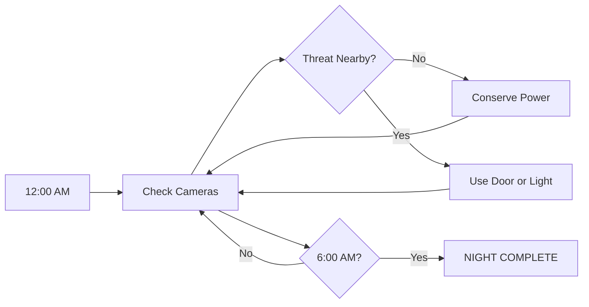

<div align="center">

# FIVE NIGHTS AT NEEGY'S

### `MONEY NEVER SLEEPS.`

**A browser-based FNAF-inspired horror parody.**

Survive five nights. Watch the cameras. Manage your power.
And whatever you do... **don't get caught lacking.**


</div>

---

## 🎮 Enter Neegy's

> **12:00 AM**
> The doors are locked. The cameras are live. The power meter is dropping.
> Something is moving in the building.

You have one job:

# MAKE IT TO 6:00 AM.

<details>
<summary><strong>▶ START NIGHT 1</strong></summary>

<br>

```text
12:00 AM

POWER: ██████████ 100%

CAMERAS: ONLINE
DOORS: READY
LIGHTS: READY

[ SYSTEM ] Welcome to Neegy's.

[ SYSTEM ] Survive until 6:00 AM.

[ WARNING ] Money never sleeps.
```

### OBJECTIVE

Learn the building.

Watch movement through the cameras.

Use your doors only when needed.

Conserve power.

Survive.

</details>

<details>
<summary><strong>▶ NIGHT 2</strong></summary>

<br>

The building gets quieter.

That is not a good thing.

```text
DIFFICULTY

██░░░
```

More movement.

Less time to react.

</details>

<details>
<summary><strong>▶ NIGHT 3</strong></summary>

<br>

Something knows you're watching.

```text
DIFFICULTY

███░░
```

Camera activity increases.

Power becomes harder to manage.

Safe windows get shorter.

</details>

<details>
<summary><strong>▶ NIGHT 4</strong></summary>

<br>

No more wasting power.

Every bad decision costs you.

```text
DIFFICULTY

████░
```

Check.

React.

Close.

Open.

Repeat.

</details>

<details>
<summary><strong>▶ NIGHT 5</strong></summary>

<br>

No training wheels.

No easy routes.

No mercy.

```text
DIFFICULTY

█████
```

Just survive.

</details>

<details>
<summary><strong>🔒 NIGHT 6: OVERTIME</strong></summary>

<br>

```text
LOCKED
```

Finish the original five nights first.

### STATUS

Planned.

</details>

---

# 📹 SECURITY SYSTEM

| System     | Purpose                       | Risk                                   |
| ---------- | ----------------------------- | -------------------------------------- |
| 📷 Cameras | Track movement around Neegy's | Watching too long wastes valuable time |
| 🚪 Doors   | Block threats                 | Uses power                             |
| 💡 Lights  | Check nearby areas            | Uses power                             |
| 🔋 Power   | Keeps your office operational | Hit 0% and you're cooked               |
| 🕛 Clock   | Tracks your survival          | Reach 6:00 AM                          |

---

# 🔋 POWER

Power controls nearly everything.

```text
██████████ 100%

████████░░ 80%

██████░░░░ 60%

████░░░░░░ 40%

██░░░░░░░░ 20%

░░░░░░░░░░ 0%
```

At `0%`...

good luck 💀

---

# 🗺️ GAME LOOP



---

# 💸 THE NEEGY'S VIBE

The game uses a dark money-themed style built around:

* black backgrounds
* neon green lighting
* gold accents
* security camera static
* CRT effects
* glitchy UI
* dark rooms
* money imagery
* flickering lights
* distorted audio
* ominous ambience

Basically:

```text
BLACK

GREEN

GOLD

DARKNESS

MONEY
```

---

# 👁️ CAMERA SYSTEM

The player will be able to switch between security cameras around the building.

Example layout:

```text
              ┌───────────┐
              │  CAM 01   │
              │ MAIN ROOM │
              └─────┬─────┘
                    │
       ┌────────────┴────────────┐
       │                         │
┌──────▼──────┐           ┌──────▼──────┐
│   CAM 02    │           │   CAM 03    │
│ LEFT HALL   │           │ RIGHT HALL  │
└──────┬──────┘           └──────┬──────┘
       │                         │
       └────────────┬────────────┘
                    │
              ┌─────▼─────┐
              │  OFFICE   │
              │   YOU     │
              └───────────┘
```

---

# 🛠️ DEVELOPMENT STATUS

* [x] Repository created
* [x] Game concept created
* [x] Name chosen
* [x] README created
* [ ] Main menu
* [ ] Office
* [ ] Camera UI
* [ ] Camera switching
* [ ] Power system
* [ ] Door controls
* [ ] Light controls
* [ ] Clock system
* [ ] Enemy AI
* [ ] Enemy movement
* [ ] Night progression
* [ ] Audio
* [ ] Ambience
* [ ] Static effects
* [ ] Jumpscares
* [ ] Game over screen
* [ ] Night complete screen
* [ ] Night 6 / 7
* [ ] Extras menu
* [ ] Settings
* [ ] Final browser build

---

# 📁 PLANNED FILE STRUCTURE

```text
five-nights-at-neegys/
│
├── index.html
│
├── css/
│   └── style.css
│
├── js/
│   ├── game.js
│   ├── cameras.js
│   ├── power.js
│   ├── enemies.js
│   ├── nights.js
│   └── audio.js
│
├── assets/
│   │
│   ├── audio/
│   │   ├── ambience/
│   │   ├── effects/
│   │   └── jumpscares/
│   │
│   ├── images/
│   │   ├── cameras/
│   │   ├── office/
│   │   ├── enemies/
│   │   └── ui/
│   │
│   └── video/
│
└── README.md
```

---

# 🚫 NO FORKING

## PLEASE DO NOT FORK THIS REPOSITORY.

This project is not open for unofficial copies or forks.

Do not:

* fork the repository
* mirror the repository
* reupload the project
* redistribute the files
* claim the project as your own
* create unofficial modified builds without permission

If you want to contribute, discuss it with the project owner first.

```text
STAR THE REPO?        YES

WATCH THE REPO?       YES

CHECK OUT THE CODE?   YES

FORK IT?              NAH.
```

---

# ⚠️ DISCLAIMER

**Five Nights at Neegy's** is an original fan-made parody project inspired by the survival-horror camera-management genre.

This project is not an official **Five Nights at Freddy's** game.

It is not affiliated with or endorsed by Scott Cawthon or the official FNAF franchise.

---

<div align="center">

# `12:00 AM`

↓

# `1:00 AM`

↓

# `2:00 AM`

↓

# `3:00 AM`

↓

# `4:00 AM`

↓

# `5:00 AM`

↓

# `6:00 AM`

### NIGHT COMPLETE

---

## WATCH.

## CONSERVE.

## SURVIVE.

# MONEY NEVER SLEEPS.

</div>
